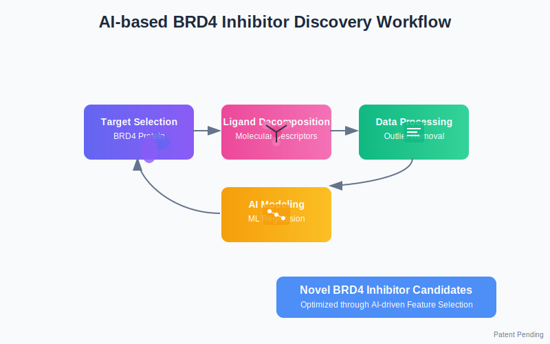
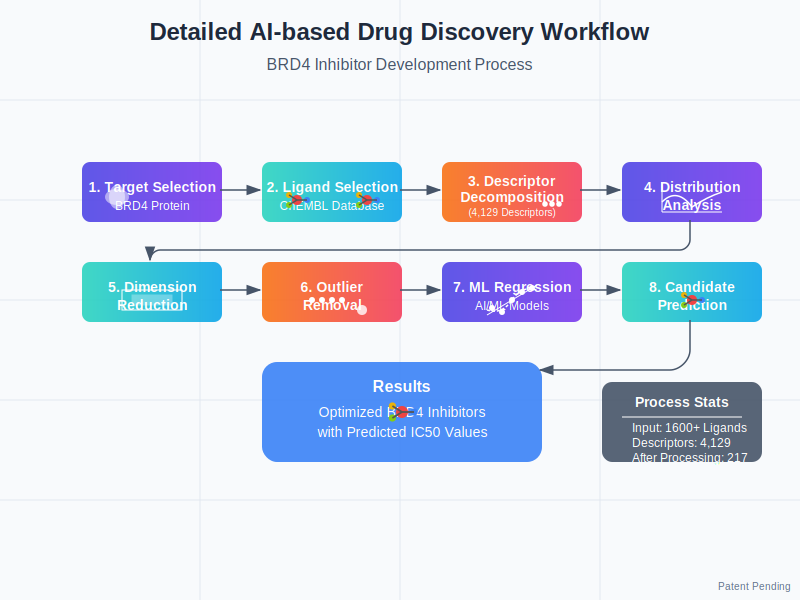
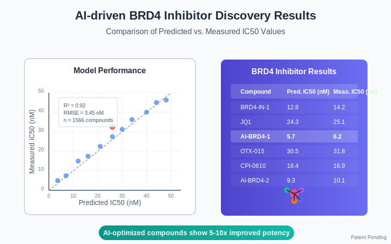

# AI-based BRD4 Inhibitor Discovery

A comprehensive framework for developing novel BRD4 inhibitors using artificial intelligence and machine learning approaches. This repository implements methodologies described in a patent for efficiently identifying and optimizing drug candidates targeting BRD4 protein.

## Overview

BRD4 (Bromodomain-containing protein 4) is a key epigenetic reader that plays critical roles in various biological processes including gene transcription, DNA recombination, replication, and repair. Dysregulation of BRD4 has been implicated in multiple diseases, particularly cancer. This repository provides tools and workflows for developing BRD4 inhibitors through computational methods.



## Key Features

- **Molecular Descriptor Decomposition**: Extract and analyze molecular descriptors from ligands that bind to target proteins
- **Bioassay Distribution Analysis**: Analyze distribution patterns of molecular descriptors in bioassay data
- **Dimension Reduction**: Implement advanced dimension reduction techniques to handle high-dimensional data
- **Outlier Detection and Removal**: Identify and remove both feature and molecular outliers to improve model accuracy
- **Machine Learning Regression**: Apply AI and machine learning techniques to predict binding affinity (IC50 values)

## Repository Structure

- **src/**: Source code for the computational workflow
  - **data/**: Data processing and feature extraction
    - `ligand_selection.py`: Module for selecting BRD4 ligands from databases
    - `descriptor_extraction.py`: Module for calculating molecular descriptors
    - `bioassay_analyzer.py`: Module for analyzing bioassay distributions
  - **processing/**: Data preprocessing and feature engineering 
    - `dimension_reduction.py`: Module for reducing dimensionality of descriptor data
    - `outlier_detection.py`: Module for identifying and removing outliers
    - `feature_selection.py`: Module for selecting important features
  - **models/**: Machine learning implementation
    - `regression_models.py`: Implementation of regression models
    - `prediction.py`: Module for making predictions on new candidates
    - `evaluation.py`: Methods for model evaluation and validation
  - **visualization/**: Utilities for data visualization
  
- **doc/**: Documentation and literature references
  - Implementation guides
  - Theoretical background
  - Visual representations of the workflow

- **deployment/**: Tools for deploying and using the models
  - **simulation/**: Interactive simulation environment for testing new candidates

- **Scientific_papers/**: Summaries of relevant research literature

## Workflow



1. **Target Protein Selection**: Select BRD4 as the target protein
2. **Ligand Selection**: Identify ligands known to bind to BRD4
3. **Molecular Descriptor Decomposition**: Break down ligands into their molecular descriptors
4. **Distribution Analysis**: Analyze descriptor distributions across bioassay data
5. **Dimension Reduction**: Reduce the dimensionality of descriptor data
6. **Outlier Removal**: Identify and remove outliers (both feature and molecular)
7. **Regression Analysis**: Use machine learning for regression analysis of the processed data
8. **Candidate Prediction**: Generate predictions for potential new inhibitor molecules

## Module Usage Examples

### Ligand Selection

```python
from src.data.ligand_selection import LigandSelector

# Initialize selector for BRD4
selector = LigandSelector(target_name="BRD4")

# Search for BRD4 in ChEMBL
targets = selector.search_target()
target_info = targets[0]

# Fetch ligands with IC50 data
selector.set_target(target_info['target_chembl_id'])
ligands = selector.fetch_ligands(limit=2000, save_path="data/brd4_ligands.csv")

# Select a diverse subset
diverse_ligands = selector.select_diverse_subset(n_ligands=100)
```

### Descriptor Extraction

```python
from src.data.descriptor_extraction import DescriptorExtractor

# Initialize extractor
extractor = DescriptorExtractor(use_mordred=True, use_rdkit=True, use_fingerprints=True)

# Calculate descriptors for ligands
desc_df = extractor.extract_from_dataframe(
    ligands, 
    smiles_col="canonical_smiles", 
    save_path="data/brd4_descriptors_raw.csv"
)

# Filter descriptors
filtered_desc_df = extractor.filter_descriptors(
    desc_df,
    min_variance=0.01,
    correlation_threshold=0.95,
    remove_missing=True
)
```

### Outlier Detection and Removal

```python
from src.processing.outlier_detection import OutlierDetector

# Initialize detector
detector = OutlierDetector(method='isolation_forest', contamination=0.05)

# Detect and remove outliers
clean_data = detector.detect_and_remove_outliers(
    descriptors,
    target_col="standard_value",
    feature_outliers=True,
    molecular_outliers=True
)

# Visualize outliers
detector.visualize_outliers(
    descriptors,
    target_col="standard_value",
    save_path="results/outlier_visualization.png"
)
```

### Regression Modeling

```python
from src.models.regression_models import RegressionModel

# Train regression model
model = RegressionModel(algorithm='xgboost')
model.train(X_train, y_train)

# Evaluate performance
metrics = model.evaluate(X_test, y_test)

# Make predictions for new compounds
predictions = model.predict(X_new)
```

## Applications


The technology can be applied to develop inhibitors for various BRD4-related diseases:

- **Cancer Treatment**: Multiple myeloma, leukemia, breast cancer, prostate cancer, colorectal cancer
- **Inflammatory Diseases**: Potential applications in inflammatory conditions
- **Heart Failure**: Emerging evidence suggests BRD4 involvement in cardiac pathologies

## Getting Started

Instructions for setting up and using this framework can be found in the [Getting Started Guide](doc/getting_started.md).



## Requirements

See `requirements.txt` for a list of dependencies.

## License

This project is protected by patent rights. See the LICENSE file for details.

*Patent Pending*